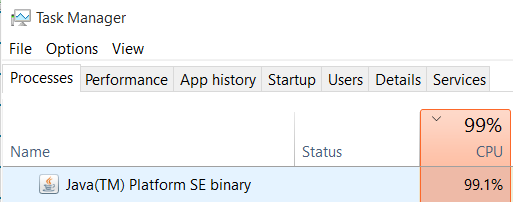

#1: Broken

There are clearly multiple concurrency related issues occurring with “broken” The behavior we see is generally something along the lines of this: Producers produce too many products(>10), monitor identifies the queue is too full(19), consumers begin consuming, there are sometimes null pointer exceptions, and then there is only visible monitor behavior from that point on. 

The first potential issue can be visible in this output: 
```
Producer 0 Produced: Product<0> on iteration 0
Producer 3 Produced: Product<11> on iteration 2
Producer 0 Produced: Product<12> on iteration 1
Producer 7 Produced: Product<6> on iteration 0
Producer 1 Produced: Product<0> on iteration 0
```

####Race Condition 1
Notice that the Product Id’s that producer 0 and producer 1 produced are the same(Product<0>). Products should all have unique ID’s, so this indicates some race condition is occuring with product creation. 

```
private static int _id = 0;

 public Product() {
    id   = _id;
    name = "Product<" + id + ">";
    _id++;
    done = false;
  }
  ```
  
  The issue is revealed by the constructor for Product. They are sharing one instance of _id, and using it to assign Id's. However, the creation of products is not synchronized in any way, so this critical section is unprotected. 
 
####Race Condition 2
 
  The next issue is another race condition. The following section of code is a critical section for the producers, but is not protected. 
  
  ```
        if (queue.size() < 10) {
        Product p = new Product();
        String msg = "Producer %d Produced: %s on iteration %d";
        System.out.println(String.format(msg, id, p, count));
        queue.append(p);
        count++;
      }
  ```
   Because all producers can enter this section concurrently, they could all do a read on the queue size at say, 19, and all decide to produce one more product. Then, even though the queue is now full after one more production, an extra 9 products have been added. The below output, from the beginnig of the execution, shows that far too many products are creating, indicating another race condition problem.
  
  ```
Producer 5 Produced: Product<5> on iteration 0, 0
Producer 1 Produced: Product<2> on iteration 0, 0
Producer 6 Produced: Product<6> on iteration 0, 0
Producer 4 Produced: Product<4> on iteration 0, 0
Producer 1 Produced: Product<10> on iteration 1, 2
Producer 4 Produced: Product<12> on iteration 1, 4
Producer 1 Produced: Product<13> on iteration 2, 5
Producer 4 Produced: Product<14> on iteration 2, 6
Producer 9 Produced: Product<9> on iteration 0, 0
Producer 4 Produced: Product<16> on iteration 3, 8
Producer 9 Produced: Product<17> on iteration 1, 9
Producer 3 Produced: Product<0> on iteration 0, 0
Producer 8 Produced: Product<8> on iteration 0, 0
Producer 2 Produced: Product<0> on iteration 0, 0
Producer 1 Produced: Product<15> on iteration 3, 7
Producer 7 Produced: Product<7> on iteration 0, 0
Producer 0 Produced: Product<3> on iteration 0, 0
Producer 5 Produced: Product<10> on iteration 1, 2
Producer 6 Produced: Product<11> on iteration 1, 3
  ```
 
####Producers/Consumers stall out

When this code is run, this happens to my CPU. 



Very high CPU utilization, with no progress being made. If we had locks, we may suspect some sort of livelock situation. However, since there is no syncronization implemented, the issue must lie with the "while" loops in the producers/consumers. I added some basic output in the form of an "else" statement, in both the proder and consumer. I saw that all consumers stop because they see that `queue.size()` eventually starts returning 0, always. From the producers perspective, `queue.size()` returns some number larger than 10. Therefore, all threads keep looping and using CPU, but nothing is happening. My suspicion here is that there are the obvious race conditions in the queue modification(which also lead to the null pointer exception that ends the life of some threads, an artifcat of race conditions), but it seems like queue.size() reads seem to be getting stuck, as if they are not updating. My suspicion was this could have to do with the java memory barrier. The ProductionLine queue is built using a list, but updates to the list do not cross the memory barrier between producers and consumers. Producers have no way knowing that after the consumers kick in, there is now room again to add to the queue. They still see the size of the queue at 19.Modifying the following line in ProductionLine `private List<Product> products;` to include `volatile` changes the behavior (but does not prevent any of the other problems) and prevents this infinite stuck loop most of the time. 

  
  
#2: Broken2
Putting the keyword `synchronized` separately in the methods of 'ProductionLine.java' file sychronizes these methods independent of each other. However, it does not rid the program of all the concurrency issues.

####Race Condition 1:
In the 'Producer.java' file, the following snippet of code demonstrates that there is still race conditions happening around the code `Product p = new Product()`.

```
    while (count < 20) {
      if (queue.size() < 10) {
  
        Product p = new Product();
        String msg = "Producer %d Produced: %s on iteration %d";
        System.out.println(String.format(msg, id, p, count));
        queue.append(p);
        count++;
      }
    }
```

Adding `synchronized` keyword on the 'ProductionLine.java' file does not address the issue of race condition around the creation of new products that get added to the queue. To illustrate the race condition, let's take a look at the following output obtained when running the broken 2 program.


Output excerpt:
```
Queue empty!
Producer 1 Produced: Product<1> on iteration 0
Producer 0 Produced: Product<0> on iteration 0
Producer 0 Produced: Product<8> on iteration 1
Producer 0 Produced: Product<9> on iteration 2
Producer 0 Produced: Product<10> on iteration 3
Producer 1 Produced: Product<8> on iteration 1
Producer 0 Produced: Product<11> on iteration 4
Producer 7 Produced: Product<7> on iteration 0
Producer 7 Produced: Product<14> on iteration 1
Producer 7 Produced: Product<15> on iteration 2
Producer 3 Produced: Product<3> on iteration 0
Producer 4 Produced: Product<4> on iteration 0
Producer 5 Produced: Product<5> on iteration 0
Producer 6 Produced: Product<6> on iteration 0
Producer 2 Produced: Product<2> on iteration 0
Producer 0 Produced: Product<13> on iteration 5
Producer 1 Produced: Product<12> on iteration 2
Too many items in the queue: 17!
Too many items in the queue: 17!
Consumer 1 Consumed: Product<1>
Consumer 1 Consumed: Product<0>
Consumer 1 Consumed: Product<8>
Consumer 3 Consumed: Product<9>
Consumer 3 Consumed: Product<10>
Consumer 3 Consumed: Product<8>
```

In the output excerpt, looking at `Product<8>`, it is evident that there is race condition around product creation. `Product<8>` gets created by Producers 0 and 1 and consumers 1 and 3 consume the product. This shows that adding the `synchronized` in all the methods of 'ProductionLine.java' does not rid the program of all the race conditions.

####Race Condition 2:
In spite of using the `synchronized` keyword, there is still a race condition. `synchronized` keyword does not co-ordinate the actions between different methods. The action of retrieving a product from the queue should be followed by decrementing the size of the queue and then only another consumer thread should be allowed to check the size of the queue. Hence, retrieve and size checking should be handled as **a transaction**. Similarly, when a producer produces an item, it is followed by increasing the size of the queue. Adding `synchronized` keyword on the retrieve, append and size methods in 'ProductionLine.java'  does not guarantee that the folloiwng actions will be handled as a transaction:
* append a product and then increment the size of the queue
* retrieve a product and then decrement the size of the queue

This might lead to a situation where, for instance, 8 threads read the size of the queue being greater than zero. Hence, they enter the following section of code in a synchronized fashion but before the size of the queue gets updated by consumer threads already inside the `if` statement.

```
if (queue.size() > 0) {
        Product p = queue.retrieve();
        if (p.isDone()) {
          String msg = "Consumer %d received done notification. Goodbye.";
          System.out.println(String.format(msg, id));
          return;
        } else {
          products.put(p.id(), p);
          String msg = "Consumer %d Consumed: %s";
          System.out.println(String.format(msg, id, p));
        }
      }
```

This situation becomes catastrophic if the number of elements in the queue is 7 and there are 8 consumer threads in the `if` statement awaiting to retrieve the products from the queue in a synchronized manner. This leads to the program running into  `IndexOutOfBoundsException`.

On running broken 2 program, the following output was obtained that demonstrates the existence of race condition 2. When running the program, the following `IndexOutOfBoundsException` was seen:

```
Producer 7 Produced: Product<152> on iteration 4Exception in thread "Thread-18" java.lang.IndexOutOfBoundsException: Index: 0, Size: 0
	at java.util.LinkedList.checkElementIndex(LinkedList.java:553)
	at java.util.LinkedList.remove(LinkedList.java:523)
	at ProductionLine.retrieve(ProductionLine.java:21)
	at Consumer.run(Consumer.java:20)
	at java.lang.Thread.run(Thread.java:745)
``` 

As a result of the `IndexOutOfBoundsException`, the consumer thread was killed. This created a scenario where all the producer threads produced but there weren't enough consumer threads to empty the queue.

```
Producer 7 Produced: Product<190> on iteration 10
Producer 7 Produced: Product<191> on iteration 11
Producer 7 Produced: Product<192> on iteration 12
Producer 7 Produced: Product<193> on iteration 13
Producer 7 Produced: Product<194> on iteration 14
Producer 7 Produced: Product<195> on iteration 15
Consumer 6 Consumed: Product<187>
Consumer 6 Consumed: Product<188>
Consumer 6 Consumed: Product<189>
Consumer 6 received done notification. Goodbye.
Producer 5 is done. Shutting down.
Consumer 9 Consumed: Product<190>
Consumer 9 Consumed: Product<191>
Consumer 9 Consumed: Product<192>
Consumer 9 Consumed: Product<193>
Consumer 9 Consumed: Product<194>
Consumer 9 Consumed: Product<195>
Consumer 9 Consumed: Product<186>
Consumer 9 received done notification. Goodbye.
Producer 7 Produced: Product<196> on iteration 16
Producer 7 Produced: Product<197> on iteration 17
Producer 7 Produced: Product<198> on iteration 18
Producer 7 Produced: Product<199> on iteration 19
Producer 7 is done. Shutting down.
0
1
2
3
4
5
6
7
8
9
10
```

The above excerpt shows that Producer 7 produced product 199. However, the consumer only consumed upto 195 as seen in the following excerpt.

```
179
180
181
182
183
184
185
186
187
188
189
190
191
192
193
194
195

```
#3 Fixed
